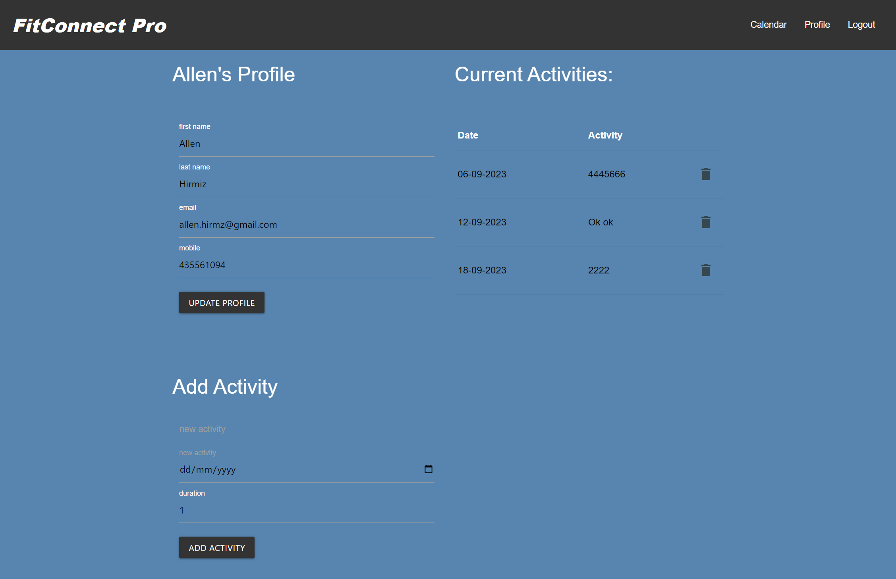
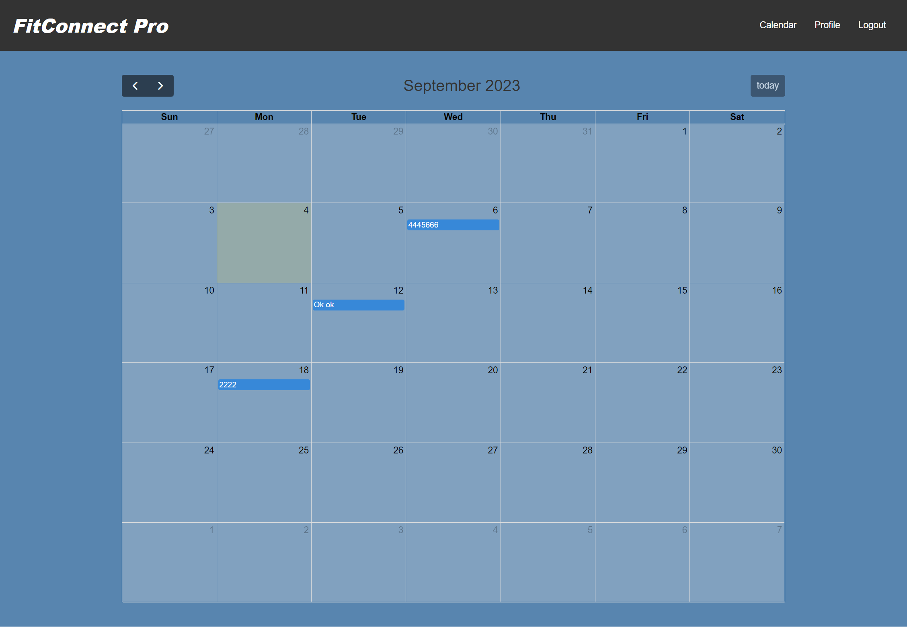

# Activity Tracker

Project overview goes here

## GitHub Repo URL
https://github.com/AllenHirmiz/Protfolio-Website-Advanced-CSS

## Website URL
https://radiant-temple-68140-fe49fe21fe71.herokuapp.com/

## Table of Contents
Navigation menu
Cover photo
Login
Sign up
Sign out
Profile Page
Calendar Page

## Installation
Web Based
## Technologies Used
The Activity Tracker website is built using the following technologies:

HTML5: The structure and layout of the web pages.
CSS3: Styling and visual enhancements for an appealing user interface.
JavaScript: Dynamic and interactive elements, such as animations and form validation.
Git: Version control system for managing codebase changes.
GitHub Pages: Hosting service for deploying the website.
NodeJS:
inquirer Library: 
express Library:
mysql2 Library
Materialize framework:
FullCalendar:

## Mock-Up

The following image shows the web application's appearance and functionality:

## Main Page

## Profile Page

## Calendar Page

## Mobile Layout
